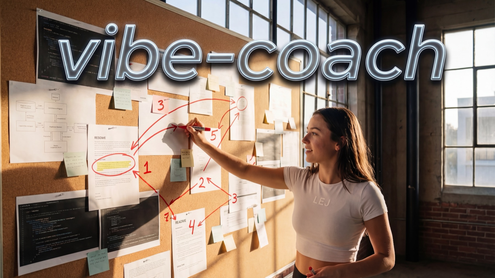
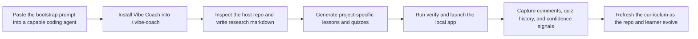

  

# Vibe Coach

  
  
  
  
  
  
  

  The educational platform that teaches you while you build.

Vibe Coach turns a repo into a living course.

You paste one prompt into a capable coding agent. The agent installs Vibe Coach into `./.vibe-coach/`, researches the host repo, writes a lesson path, seeds quizzes, and leaves behind a repo-local learning layer that future humans and agents can keep improving.

## What You Get

- repo-specific research source files in markdown, imported into SQLite
- a progressive lesson path generated from that research
- quizzes, notes, and confidence tracking
- a repo-local onboarding layer that future agents can resume
- shared teaching artifacts in git and private learner state kept local

## Why This Exists

Most onboarding docs are stale, generic, or disconnected from the code.

Vibe Coach takes a different approach:

- research starts as human-editable markdown source files and is imported into SQLite
- lessons, quizzes, comments, and progress live in SQLite
- learner comments and quiz results become feedback for the next pass
- the learning layer lives inside the repo it teaches

That makes it useful for:

- onboarding new collaborators
- learning a codebase outside your domain
- preserving architectural reasoning as a project evolves
- giving future agents persistent context that survives the chat window

## How It Works

## Install In One Prompt

The intended flow is:

1. Open your project in Claude Code, Codex, Cursor, or another capable coding agent.
2. Copy the prompt from [`prompts/bootstrap-into-current-repo.md`](./prompts/bootstrap-into-current-repo.md).
3. Paste it into the agent.
4. Let the agent install Vibe Coach into `./.vibe-coach/`.
5. Open Vibe Coach in the browser and start learning your actual project.

The refresh flow lives in [`prompts/refresh-current-repo.md`](./prompts/refresh-current-repo.md).

## What Gets Installed

Inside a host repo, Vibe Coach is meant to live at:

- `./.vibe-coach/`

Shared artifacts that belong in git:

- `./.vibe-coach/AGENTS.md`
- `./.vibe-coach/vibe-coach.project.ts`
- `./.vibe-coach/research/...`
- `./.vibe-coach/server/content.ts`
- `./.vibe-coach/docs/...`
- the reusable engine code

Local-only artifacts that should stay uncommitted:

- `./.vibe-coach/data/*.sqlite`
- `./.vibe-coach/data/*.sqlite-shm`
- `./.vibe-coach/data/*.sqlite-wal`

That split lets teams share the teaching system while each developer keeps personal quiz history, comments, and progress local.

## Run This Repo

1. Install dependencies with `npm install`.
2. Seed the database with `npm run db:sync`.
3. Start the app with `npm run dev`.
4. Open `http://localhost:5173`.

## Scripts

- `npm run dev`
  Starts the Vite frontend and Express API together.
- `npm run verify`
  Runs the baseline validation pass: DB sync, lint, and build.
- `npm run build`
  Type-checks and builds the frontend.
- `npm run serve`
  Serves the built frontend through the Express app.
- `npm run db:sync`
  Synchronizes SQLite with the current research and curriculum.
- `npm run db:reset`
  Recreates the database from seed data.

## Current Product Boundary

Already working:

- research browsing
- progressive lesson navigation
- quiz scoring and history
- confidence and completion tracking
- learner comments as teaching signals
- embedded install prompts for capable agents

Not automated yet:

- autonomous repo research without a bootstrap prompt
- autonomous curriculum generation without editing `server/content.ts`
- automatic lesson rewrites from learner feedback

That is intentional. The repo is biased toward inspectability over AI magic.

## Key Files

- [`AGENTS.md`](./AGENTS.md)
  The repo-level instructions another AI should follow.
- [`vibe-coach.project.ts`](./vibe-coach.project.ts)
  Project context, embedded install rules, and the adaptation blueprint.
- [`docs/embedded-install-mode.md`](./docs/embedded-install-mode.md)
  The install shape for embedding Vibe Coach into another repo.
- [`docs/full-automation-loop.md`](./docs/full-automation-loop.md)
  The target end-to-end product workflow.
- [`docs/repo-schema.md`](./docs/repo-schema.md)
  The repo contract for reuse.
- [`docs/ai-builder-playbook.md`](./docs/ai-builder-playbook.md)
  The practical adaptation workflow.
- [`prompts`](./prompts)
  Copy-paste entrypoints for capable coding agents.

## Contributing

Start with [CONTRIBUTING.md](./CONTRIBUTING.md).

The short version:

- keep the engine stable
- keep the teaching artifacts inspectable
- keep the adaptation workflow dead simple

## Open Source

Vibe Coach is released under the [MIT License](./LICENSE).
